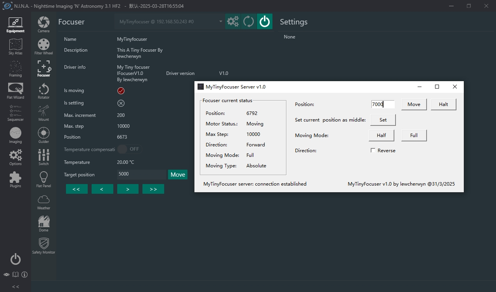

# MyTinyFocuser
This is a MyTinyFocuser prototype built following the ASCOM Alpaca protocol! It can use a 28BYJ-48 stepper motor with a ULN2003 driver board and an Arduino to create a cheap focuser.

